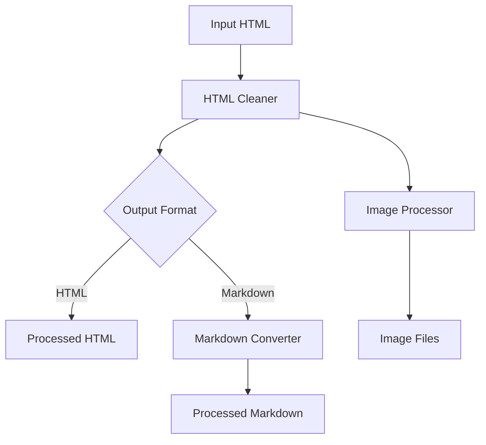

# Confluence to Markdown Conversion Technical Specification

## 1. Overview

This document outlines the technical specifications for adding Markdown conversion capabilities to the Tool Conversor Confluence. The feature will enable users to convert Confluence HTML exports to well-structured Markdown files with proper handling of images, tables, and other rich content.

## 2. Goals

- Convert Confluence HTML exports to clean, well-formatted Markdown
- Extract and properly reference images as separate files
- Maintain document structure and hierarchy
- Support all major Confluence content elements (tables, code blocks, etc.)
- Ensure backward compatibility with existing HTML/DOCX pipeline
- Provide a configuration-driven approach for customization

## 3. Architecture

### 3.1 Component Diagram



### 3.2 Data Flow

1. **Input**: Confluence HTML export files
2. **Processing**:
   - Clean HTML (remove Confluence-specific markup)
   - Extract and process images
   - Convert to Markdown
   - Update references
3. **Output**:
   - Markdown files
   - Image files in `images/` directory
   - Metadata file (optional)

## 4. Detailed Design

### 4.1 Configuration

Add the following to `config/default_config.yaml`:

```yaml
# Markdown conversion settings
markdown:
  enabled: true  # Enable Markdown output
  output_dir: "markdown"  # Subdirectory for markdown output
  image_dir: "images"  # Subdirectory for images (relative to markdown file)
  image_output: "images"  # Where to store images (relative to output_dir)
  extensions:  # Markdown extensions to enable
    - tables
    - fenced_code
    - footnotes
  code_style: "github"  # Code block style (github, fenced, etc.)
  preserve_internal_links: true  # Convert internal links to markdown links
  flatten_output: false  # Output all markdown files in a single directory
```

### 4.2 Image Handling

#### Current Implementation
- Images are embedded as Base64 data URIs in HTML
- Processed in `HTMLCleaner._process_images()`

#### New Implementation
1. **Extraction**:
   - Save images to `{output_dir}/{image_output}/{page_id}/`
   - Generate unique filenames using content hash
   - Preserve original extension when possible

2. **Referencing**:
   - Update image references in Markdown to use relative paths
   - Example: ``

### 4.3 HTML to Markdown Conversion

#### Conversion Rules
| HTML Element | Markdown Equivalent |
|--------------|---------------------|
| `<h1>-<h6>` | `#` - `######` |
| `<p>` | Blank line + text |
| `<a href="...">` | `[text](url)` |
| `` | `` |
| `<ul>`, `<ol>` | `-` or `1.` |
| `<table>` | GitHub-flavored table |
| `<code>` | `` `code` `` |
| `<pre><code>` | ` ```language\ncode\n``` ` |
| `<blockquote>` | `> ` |
| `<hr>` | `---` |

### 4.4 Special Cases

#### 1. Tables
- Convert to GitHub-flavored markdown tables
- Handle colspan/rowspan with HTML fallback if needed

#### 2. Code Blocks
- Preserve language hints
- Support syntax highlighting
- Handle inline code spans

#### 3. Internal Links
- Convert Confluence page links to markdown links
- Handle anchor links
- Support for link text customization

#### 4. Attachments
- Convert to downloadable links
- Option to include as base64 data URIs

## 5. Implementation Details

### 5.1 New Modules

#### `core/markdown_converter.py`
```python
class MarkdownConverter:
    def __init__(self, config: Dict, logger: Optional[logging.Logger] = None):
        self.config = config
        self.logger = logger or logging.getLogger(__name__)
        
    def convert(self, html: str, page_id: str = "") -> str:
        """Convert HTML to Markdown with proper handling of Confluence elements."""
        # Implementation
        pass
    
    def _process_images(self, soup: BeautifulSoup, output_dir: Path) -> BeautifulSoup:
        """Process and extract images from HTML."""
        # Implementation
        pass
```

### 5.2 Modified Components

#### `HTMLCleaner`
- Add `convert_to_markdown` parameter
- Update `_process_images` to support file-based images
- Add method to generate clean HTML for markdown conversion

#### `FileProcessor`
- Add `output_format` parameter (html/markdown)
- Update file processing pipeline
- Handle markdown-specific file operations

## 6. Error Handling

### 6.1 Error Types
1. **Image Processing Errors**
   - Missing image files
   - Permission issues
   - Invalid image data

2. **Conversion Errors**
   - Unsupported HTML elements
   - Malformed HTML
   - Encoding issues

3. **File System Errors**
   - Permission denied
   - Disk full
   - Invalid paths

### 6.2 Recovery Strategies
- Skip problematic images with warning
- Fall back to HTML for complex elements
- Provide detailed error messages
- Support dry-run mode

## 7. Testing Strategy

### 7.1 Unit Tests
- Test individual conversion functions
- Verify HTML to Markdown transformation
- Test image extraction and linking

### 7.2 Integration Tests
- End-to-end conversion of sample Confluence exports
- Verify output structure and content
- Test with various Confluence content types

### 7.3 Performance Testing
- Large document conversion
- Memory usage with many images
- Processing time benchmarks

## 8. Dependencies

### Required
- Python 3.8+
- BeautifulSoup4 >= 4.9.0
- lxml >= 4.6.0
- docling >= 1.0.0
- pathvalidate >= 2.5.0

### Optional
- markdown >= 3.3.0 (for additional processing)

## 9. Future Enhancements

1. **Advanced Formatting**
   - Support for Mermaid diagrams
   - LaTeX math expressions
   - Custom CSS for HTML output

2. **Performance**
   - Parallel processing
   - Caching of processed images
   - Incremental conversion

3. **Integration**
   - Direct Confluence API support
   - Git integration
   - Web interface

## 10. Open Questions

1. How to handle very large exports?
2. Best approach for preserving complex layouts?
3. Support for Confluence macros?
4. Handling of embedded videos/other media?

## 11. Appendix

### A. Sample Configuration
```yaml
# Example configuration for markdown output
markdown:
  enabled: true
  output_dir: "converted/markdown"
  image_dir: "images"
  extensions:
    - tables
    - fenced_code
    - footnotes
  code_style: "github"
  preserve_internal_links: true
```

### B. Example Output Structure
```
output/
  markdown/
    page1.md
    page2.md
    images/
      page1/
        image1.png
        image2.jpg
      page2/
        image1.png
  html/  # Existing HTML output
  docx/  # Existing DOCX output
```

### C. References
- [CommonMark Spec](https://spec.commonmark.org/)
- [GitHub Flavored Markdown](https://github.github.com/gfm/)
- [docling Documentation](https://pypi.org/project/docling/)
